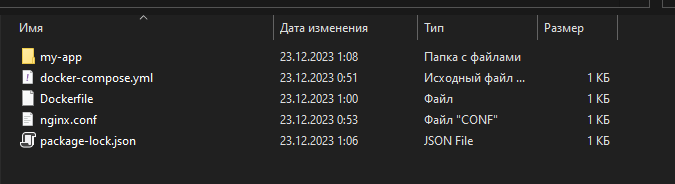
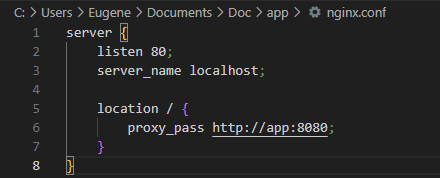
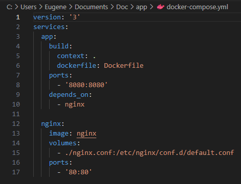

 Лабораторная работа №6
1. Перед созданием приложения, предварительно установив node.js, создаем Dockerfile, nginx.conf и docker-compose.yml
   
  

  

  

2. Запускаем приложение с помощью Docker Compose
   ```
   C:\Users\Eugene\Documents\Doc\app\my-app> docker-compose up
   ```